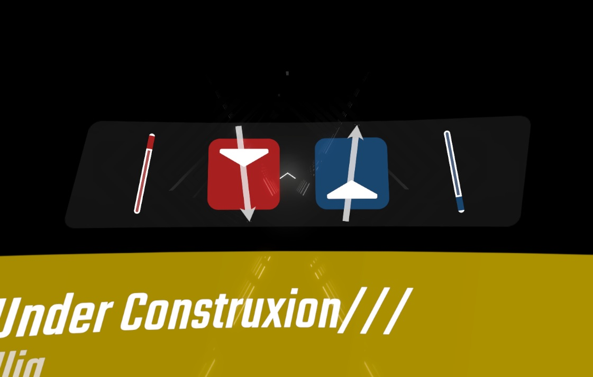

# IForgor

A Beat Saber mod that displays the last notes and saber angles before you paused in the pause menu.  This is aimed to help you not forget which direction your sabers are supposed to go.

## Installation

- Download and install BS_Utils from ModAssistant or manually
- Download and install the [latest release](https://github.com/ckosmic/PauseCamp/releases/latest) by placing the .dll in your Plugins folder

## License
[MIT](https://choosealicense.com/licenses/mit/)